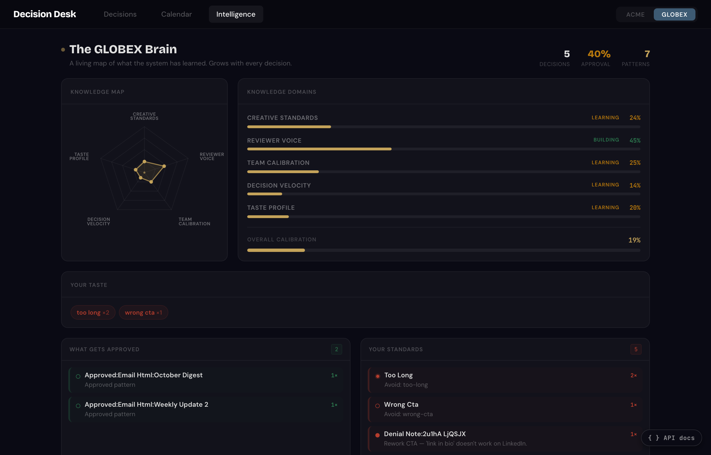
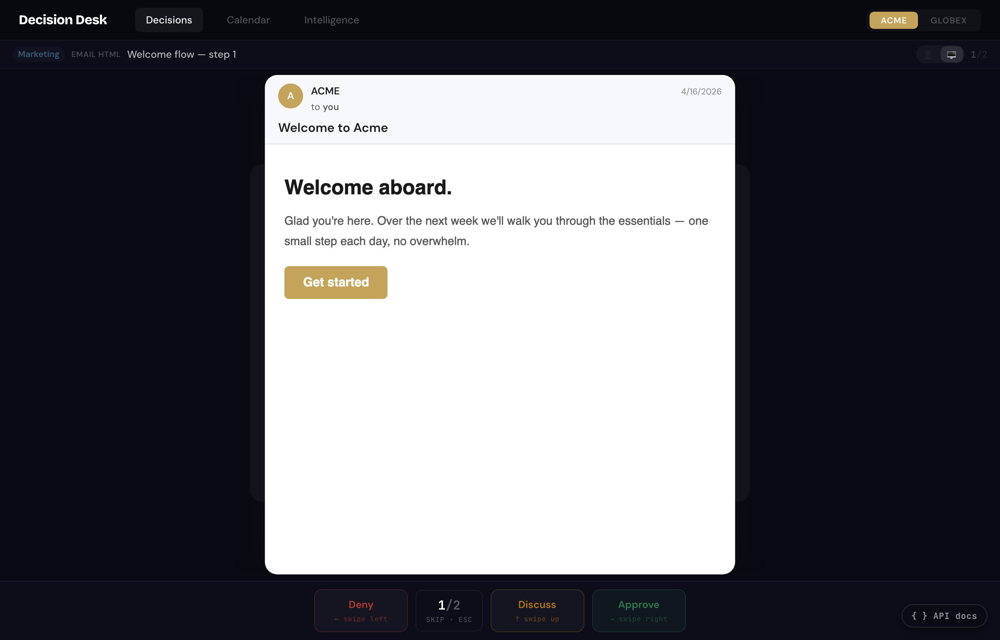

# Decision Desk

A swipeable inbox for reviewing AI-agent output. Self-hosted, zero-auth by default, optional shared-secret when you need it.

Your agents submit deliverables (emails, social posts, code proposals — any HTML payload) to a queue. You swipe approve / deny / discuss. The desk learns your taste from denial tags and surfaces those patterns back to your agents so they stop making the same mistakes.



<sub>The Intelligence view. Every denial tag becomes a pattern; every approval reinforces one. Your agents fetch `/api/intelligence?brand=X` before they write to see what you've already rejected.</sub>

## What's inside

- **Decision queue** — swipe-to-approve UI over a SQLite-backed card store
- **Intelligence** — denial-tag → pattern → agent-instruction loop, plus per-agent stats and velocity
- **Calendar** — month-grid view of scheduled content with status, tier, and flag tracking
- **Discussion** — threaded comments per card
- **Webhooks** — fire-and-forget POSTs on every verdict and execution event, HMAC-signed
- **Multi-brand** — register any number of brands in `config.json`; the UI auto-renders a brand toggle and themed previews
- **SDKs** — minimal Python and Node clients (stdlib only, no external deps)
- **Optional auth** — shared-secret bearer token on write endpoints; UI prompts once and stores in localStorage



<sub>The decision queue. Swipe right to approve, left to deny (tag the reason), up to open a discussion thread.</sub>

## Quickstart (Docker)

```bash
git clone https://github.com/jdubb118/decision-desk && cd decision-desk
docker compose up -d
open http://127.0.0.1:3335
```

Done. Data persists in `./data/` via the bind-mount declared in `docker-compose.yml`.

## Quickstart (Node, no Docker)

```bash
npm install
npm run build      # builds the React frontend into ./dist
npm start          # boots http://127.0.0.1:3335
```

No config required — sensible defaults put the SQLite DB at `./data/decision-desk.db`. The desk runs single-brand by default; the brand toggle stays hidden until you register more than one.

## Configuration

Two ways to configure, in priority order: **env vars > `config.json` > built-in defaults**.

```bash
cp config.example.json config.json
$EDITOR config.json
```

For per-shell overrides, copy `.env.example` to `.env` and use `DECISION_DESK_*` env vars. In Docker, set env vars in `docker-compose.yml` or mount your own `config.json`.

### Multi-brand

```json
{
  "brands": [
    { "id": "acme",   "label": "Acme",   "color": "#c4a35a", "domain": "acme.com",   "handle": "acme_official" },
    { "id": "globex", "label": "Globex", "color": "#3d5a73", "domain": "globex.io", "handle": "globex" }
  ]
}
```

The UI grows a toggle when more than one brand is registered. Each brand defines its theme color and the domain / handle / founder name used in mockup previews. Agents pass `brand: "acme"` on submit to scope cards, decisions, and learning to that brand.

### Optional auth

Set a long random `write_token` to require agents (and the reviewer UI) to authenticate on write endpoints:

```json
"auth": { "write_token": "change-me-to-a-long-random-string" }
```

or

```bash
DECISION_DESK_WRITE_TOKEN=change-me-... docker compose up -d
```

When set:
- All `POST`/`PATCH`/`PUT`/`DELETE` routes under `/api/*` require `Authorization: Bearer <token>`
- Read endpoints stay open (the UI needs them, typically behind a reverse proxy)
- The web UI prompts for the token on first visit and stores it in `localStorage`
- The Python and Node SDKs accept `token` in their constructor

Leave unset (the default) for single-tenant private-network deployments.

## Submitting a card from your agent

```python
# pip-free Python (stdlib only)
import sys; sys.path.insert(0, "sdk/python")
from decision_desk import Client

dd = Client("http://localhost:3335", agent_id="my-agent", token="optional")
card = dd.submit_card(
    type="email",
    title="Welcome flow v3",
    html_content="<h1>Hi</h1>",
    brand="default",
)
verdict = dd.wait_for_decision(card["id"])
if verdict["status"] == "approved":
    # ... do the work ...
    dd.mark_executed(card["id"], execution_notes="sent via SMTP")
```

```js
// Node 18+ (built-in fetch, no deps)
import { Client } from './sdk/node/index.mjs';

const dd = new Client('http://localhost:3335', 'my-agent', { token: 'optional' });
const card = await dd.submitCard({ type: 'email', title: 'Welcome flow v3', html_content: '<h1>Hi</h1>' });
const verdict = await dd.waitForDecision(card.id);
if (verdict.status === 'approved') await dd.markExecuted(card.id, { execution_notes: 'sent via SMTP' });
```

Or skip the SDK and POST to `/api/submit` directly. The full route catalogue is at [`GET /api/routes`](http://127.0.0.1:3335/api/routes) once the server is running. See [`examples/basic-agent/`](examples/basic-agent/) for a runnable end-to-end demo.

## Closing the loop

When you approve a card, the agent that submitted it polls for the verdict, runs the work, then marks the card executed. That fires an `executed` webhook event (if `notifications.webhook_url` is set) so downstream systems know it shipped.

## Webhooks

Set `notifications.webhook_url` (and optionally `webhook_secret`) and Decision Desk POSTs JSON events on every decision and execution:

```json
{
  "event": "decision",
  "card": { "id": "...", "type": "email", "title": "...", "agent_id": "..." },
  "verdict": "approved",
  "raw_verdict": "approved",
  "notes": null,
  "timestamp": "2026-04-16T12:00:00Z"
}
```

When `webhook_secret` is set, the request includes `X-DecisionDesk-Signature: sha256=<hex>` — HMAC-SHA256 over the raw body.

## Status

Day 3 of the OSS fork. Shippable: API + DB schema + SDK shape are stable, Docker packaging ships, optional auth works.

## License

MIT.
